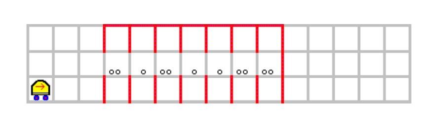

# Task Sheet 1: Niki the robot
Niki is a traditional environment to teach programming. It is about a small robot that has a very limited set of sensors and actions. However, Niki can be programmed in various ways to solve quite complex problems. As Niki does not have a concept of variables, it uses the environment of the robot to store information. In order to efficiently solve some advanced tasks, Niki provides support for recursion, allowing simple solutions to some complex problems.

Below screenshot shows the result of our joint exploration of Niki in the lecture:

## Learning Outcome
 We learn how to use loops and conditions to solve some toy problems for Niki. We prepare for the principle of recursion.

## Task 1: Doubling Numbers
Program Niki to initialize a vertical tower of deposited markers starting at location 1/1. The height of the tower shall be interpreted as an natural number. Assure and assume that the robot is located on the basement of the first tower looking right. Now, write a program (decompose it into procedures where sensible) to double the number by creating a tower right of the given tower with double the height. (Tip: An oral explanation of a possible implementation is given in the lecture video)

## Disclaimer
*Below assignments have been taken from the Niki manual. They have been formulated by various people, but not from me.*

## Task 2: Staircase

Recreate the given world (click on Arbeitsfeld->Verändern), now the mouse will show you what changes a click would do. These include 
- placing markers
- placing walls
- placing the robot

a) Write a program that knows the world and picks up the marker, brings it to the podest and deposits it there.
    
b) Based on domain knowledge that there is first a double staircase and then a podest, find the marker on the podest without knowing the detailed shape or position of the marker and bring it to the podest

## Task 3: Storage

Niki is supposed to sort the large items (two markers) into the bottom line of the depicted storage space and the small ones (one marker) into the upper row. In a first version, he keeps the X location of all of those. In a more advanced version, the result is supposed to be that the both rows are filled from left to right.
    
## Task 4: Waste Collection

Niki is somewhere within a hall. The hall has one single entrance. Along the outside wall, there is waste deposited. Niki is supposed to pick up all the waste (not knowing where exactly it is, just that it is adjacent to the wall). Write a program for it.
(Tip: Try to program it such that left of Niki is always a wall. This is called left hand rule and would walk around any polygons inner or outer boundaries. With the one hole, this rule would change from the inner to the outer boundary and back). 
This tip enlightens us with a simple fact: sometimes very hard programs can be written pretty concisely by finding an invariant (a natural language condition that remains true throughout the program or program part like a loop). Then, we do a mathematical proof that this invariant is exhausting the problem space (no programming needed) and implement the program (only make sure the invariant is never broken). This approach leads to a notion of algorithmic correctness we will discuss later.

## Task 5: Tunnel
Let Niki pick up the item in the following case

In a few weeks, extend this task by bringing the item back to the beginning of the tunnel of unknown shape. Therefore, either memory (which Niki does not have) or recursion (which Niki has) is requied.

## Task 6:  Signs in the world

The graphics visualizes a map in which Niki is supposed to follow the marked cells. The following rules are in place
- a cell filled with one marker means go straight.
- two markers and three markers stand for specific turns

